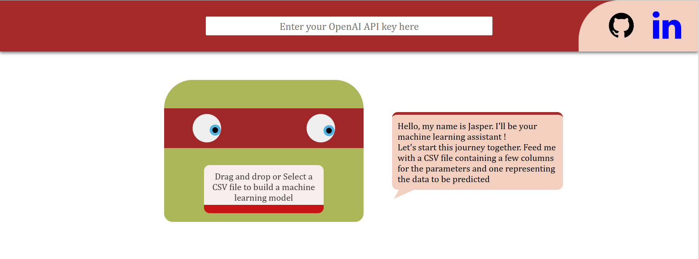
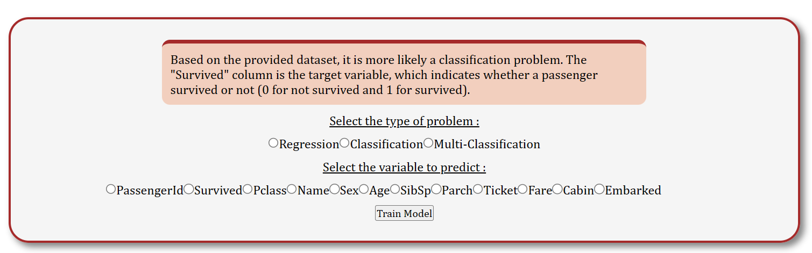
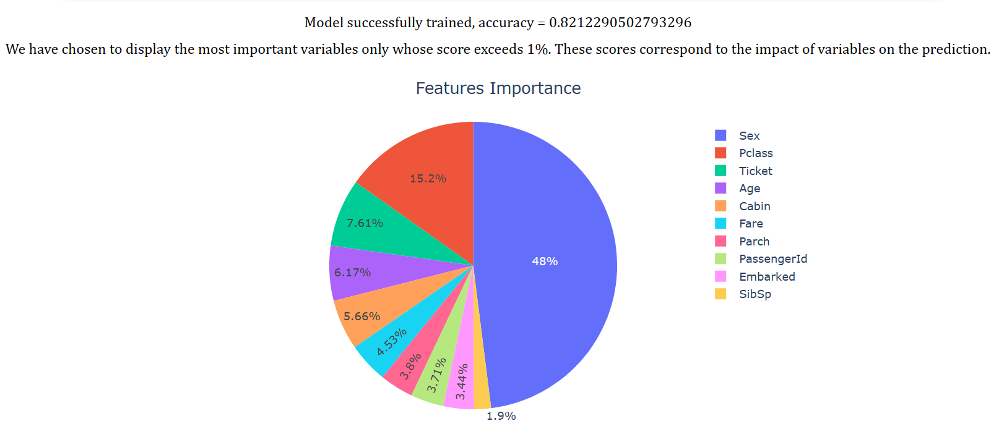
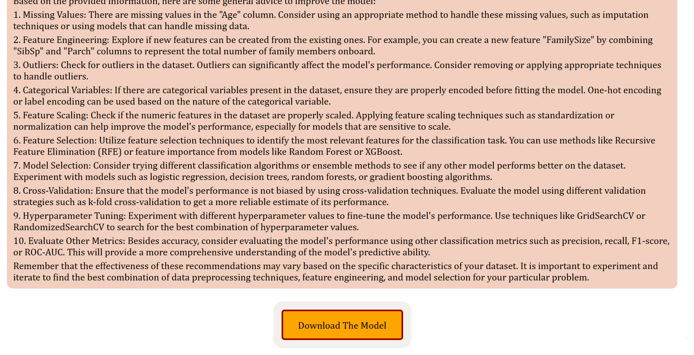

<h1 align="center"> DashChatGPT_Challenge </h1>

## Introduction
This project is a part of a community challenge launched by Plotly.
Here is the description of the challenge made by the community manager Adam Schroeder :

<em>This month’s community challenge is all about envisioning the future of AI-enabled apps. We would like to officially open this initiative to the community and challenge you to build a Dash app that integrates the ChatGPT API into your app.

The winning apps will be judged according to the following categories:

* Depth of integration of ChatGPT API into the Dash app
* App Design
* Data exploration and data analysis routines (e.g. numerical methods, machine learning, prediction, classification, optimization)</em>

## My goal
In order to propose a solution to this challenge, I decided to create a "Machine Learning Assistant". Its purpose is to allow someone that doesn't know anything about machine learning to have a very decent model and make some predictions by himself using chatGPT to give some advices.

## How does it works ?
When you start the application, you will find this interface. To start using it, you'll have to provide an openAI apikey and then feed Jasper with a csv file. I have provided three csv files as examples in this repository in the folder <code>csv_examples</code>.  
Any csv files from Kaggle should work.

Once you have provided your api key and a csv, we send a prompt to chat_gpt with the header of the dataset and we ask him whether it's a regression/classification/multi-classification problem and which variable is more likely to be predicted.

In our example, we are using a titanic dataset. As our assistant adivses us, we will predict the variable "survived" which is a classification problem so we select the right things before we click on the <code>train model</code> button. If you try to use regression on string variables, it will not work and you'll have to refresh the page, that's why it's important to follow "Jasper's" advices if you are not sure about what to do.

To train the model, I have decided to use the catboost algorithm which is one of the most powerful tool in machine learning. I decided to use catboost because it can handle very well categorical features. XGBoost would also have been a great option.
For this application, the purpose is to help someone that doesn't know anything about machine learning to understand the data and be able to predict things by himself. That's why I favored <b>speed</b> over <b>performance</b>.
Thus, I did not use cross-validation and the model iterate only 100 times. To still prevent from overfitting, we didivided the dataset into 80% for training and 20% for scoring. We are also using "early-stopping rounds" parameter which detect overfit by comparing training loss and validation loss.
### Scoring methods :
* For Classification and Multi-Classification, we display accuracy score
* For Regression problems, we display RMSE (root mean squared error)

Here are the results :

In our case, we have obtained 82.1% of correct answers on the validation set. We can also visualize the most important features, and without surprises the variable "sex" has a huge importance. Indeed, we all know the famous quote "Women and children first" when the Titanic was sinking.
Since I didn't set a random state, if you repeat the experience the results will be a little bit different.

We also asked chatGPT how can we improve the accuracy, we sent him features importances, a df.describe and our score to get his answer. It gave us a bunch of advice on data preprocessing mostly to improve our score.

Finally, the user can download the model to make some predictions by himself using python. 
It will probably look like this :
<code>
model = CatBoostClassifier() or model = CatBoostRegressor()
model.load_model(saved_model)
pred = model.predict(X) or pred = model.predict_proba(X) </code>

## How could I have improved the app :
I didn't had that much time for this app since I have a lot of other projects but here are some ideas about how could I have improved my app :
* A new tab to load a model (generated by the previous steps) and predict a CSV (you could download predictions).
* More options to improve performance over time if the user wishes (hyperparameter tuning, more iterations etc...).
* An XGBoost Jasper's opponent :D

